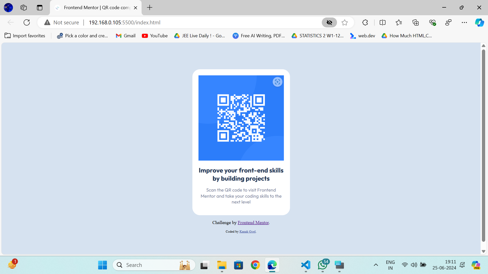

# Frontend Mentor - QR code component solution

This is a solution to the [QR code component challenge on Frontend Mentor](https://www.frontendmentor.io/challenges/qr-code-component-iux_sIO_H). Frontend Mentor challenges help you improve your coding skills by building realistic projects. 

## Table of contents

- [Overview](#overview)
  - [Screenshot](#screenshot)
  - [Links](#links)
- [My process](#my-process)
  - [Built with](#built-with)
  - [What I learned](#what-i-learned)
  - [Continued development](#continued-development)
  - [Useful resources](#useful-resources)
- [Author](#author)
- [Acknowledgments](#acknowledgments)

**Note: Delete this note and update the table of contents based on what sections you keep.**

## Overview
The QR code component solution project is a solution to the QR code component challenge on Frontend Mentor. This project aims to improve coding skills by building a realistic QR code component. 

The project includes a table of contents that provides an overview of the project structure. It also includes a screenshot section where a screenshot of the solution can be added. The screenshot can be taken using Firefox or a tool like FireShot. 

The solution also includes links to the solution URL and live site URL. These links can be updated with the appropriate URLs. 

The "My process" section outlines the approach taken to build the project. It includes information about the technologies used, such as semantic HTML5 markup and CSS custom properties. 

The "What I learned" section allows the developer to recap their major learnings while working on the project. Code snippets can be included to highlight specific areas of learning. 

The "Continued development" section outlines areas that the developer wants to focus on in future projects. This can include concepts that need further improvement or techniques that need refinement. 

The "Useful resources" section provides links to resources that helped during the challenge. These resources can be helpful for anyone viewing the solution or for future reference. 

The "Author" section includes links to the author's website, Frontend Mentor profile, and Twitter account. 

The "Acknowledgments" section allows the developer to give credit to anyone who helped with the project or provided inspiration. 

Overall, the project aims to showcase the developer's skills in building a QR code component and provide a comprehensive overview of the project structure and learnings.

### Screenshot




### Links

- Solution URL: [My Solution](https://qr-code-component-iota-pearl.vercel.app/)

## My process
To create the QR code component web page as described in the provided HTML code, follow these steps:

Set Up HTML Boilerplate:

Start with the `<!DOCTYPE html>` declaration to specify the HTML version.
Open the `<html>` tag with the lang="en" attribute to define the language.
Inside `<html>`, create the `<head>` and `<body>` sections.
Configure Head Section:

Include `<meta charset="UTF-8">` for character encoding.
Add `<meta name="viewport" content="width=device-width, initial-scale=1.0">` for responsive design.
Link a favicon with `<link rel="icon" type="image/png" sizes="32x32" href="./images/favicon-32x32.png">`.
Import the "Outfit" font from Google Fonts using `<link rel="stylesheet" href="https://fonts.google.com/specimen/Outfit">` (Note: The correct URL should be from fonts.googleapis.com).
Set the title of the web page with `<title>`.
Style the Page:

Use `<style>` tag within the `<head>` section to include CSS.
Import the "Outfit" font correctly using `@import url('https://fonts.googleapis.com/css2?family=Outfit:wght@100..900&display=swap');`.
Style the html and body to set the background color, font size, and center the content.
Define styles for .box to set its background color, border radius, width, padding, text alignment, font family, and box shadow.
Style the img within .box to control its width and height.
Apply specific font weights, sizes, and colors to h1 and p within .box.
Style the .attribution section for credits, adjusting font size, text alignment, and link colors.
Structure the Body:

Create a `<div>` with the class box to contain the QR code image, a heading (`<h1>`), and a paragraph (`<p>`) describing the action (scanning the QR code).
Include the QR code image with ``.
Add a paragraph below the .box to mention the challenge by Frontend Mentor.
Include an attribution `<div>` at the bottom with a link to the coder's profile or website.
Final Touches:

Review the code for any syntax errors or missing closing tags.
Ensure all paths (e.g., to the favicon, QR code image) are correct relative to the HTML file's location.
Validate the HTML and CSS to ensure compatibility and responsiveness across different browsers and devices.
Preview and Test:

Open the HTML file in a web browser to preview the QR code component.
Test the responsiveness by resizing the browser window and checking the layout on different devices if possible.
Deployment:

Once satisfied with the local preview, consider deploying the web page to a web server or a platform like GitHub Pages to share with others.


### Built with

- HTML5 markup
- CSS custom properties

### What I learned

This project was an enriching experience that allowed me to delve deeper into the nuances of web development, particularly focusing on creating a responsive and visually appealing QR code component. Here are some of the key learnings and highlights:

HTML5 Semantic Markup
I gained a better understanding of the importance of using semantic HTML5 elements to structure the web page. This not only helps with the readability of the code but also improves accessibility for users and search engines. For example, using <header>, <main>, and <footer> tags to define the structure of the webpage.
```
<main class="container">
  <div class="qr-code-box">
    
  </div>
</main>
```

CSS Custom Properties
The use of CSS custom properties (variables) was a game-changer in managing the site's color scheme and font sizes. It made the CSS more maintainable and easier to update. For instance, defining a color scheme and font sizes at the root level allowed me to reuse these values throughout the stylesheet, ensuring consistency and simplifying changes.

```
:root {
  --primary-color: papayawhip;
  --font-size-regular: 16px;
}

.body {
  background-color: var(--primary-color);
  font-size: var(--font-size-regular);
}
```

Responsive Design
Implementing a responsive design using media queries was crucial for ensuring the QR code component looked great on different devices. Learning to adjust the layout and font sizes based on the viewport width helped me understand the dynamics of responsive web design better.

```
@media (max-width: 768px) {
  .qr-code-box {
    width: 80%;
    padding: 20px;
  }
}
```

CSS Flexbox
Flexbox played a pivotal role in centering the QR code component and making the layout flexible. Understanding how to use display: flex; along with justify-content and align-items properties was instrumental in achieving a clean and centered layout.

```
.container {
  display: flex;
  justify-content: center;
  align-items: center;
  height: 100vh;
}
```
Deployment with GitHub Pages
Finally, deploying the project with GitHub Pages was a straightforward and effective way to share my work. Learning to navigate through GitHub's interface to set up a live site was an invaluable skill that will aid in future projects.

These learnings have significantly contributed to my growth as a web developer, reinforcing my understanding of HTML, CSS, responsive design, and deployment processes.

### Continued Development

For my future projects, I aim to focus on several key areas to enhance my skills and deliver more sophisticated web solutions. These areas include:

1. **JavaScript and Frameworks:**
   - Deepen my understanding of vanilla JavaScript to improve interactivity and functionality.
   - Explore and master at least one JavaScript framework (e.g., React, Vue, or Angular) for building more dynamic and scalable applications.

2. **CSS Preprocessors:**
   - Learn and incorporate CSS preprocessors like SASS or LESS to write more efficient, maintainable, and scalable CSS.

3. **Responsive Design Techniques:**
   - Continue to refine my responsive design skills, focusing on mobile-first design and advanced media queries to ensure optimal viewing across all devices.

4. **Web Accessibility:**
   - Prioritize web accessibility to make my projects more inclusive. This includes learning about ARIA roles, keyboard navigation, and color contrast standards.

5. **Performance Optimization:**
   - Focus on optimizing website performance, including faster load times and better user experience, through techniques like lazy loading, image optimization, and code splitting.

6. **Backend Technologies:**
   - Gain a basic understanding of backend technologies and databases to develop full-stack capabilities. Exploring Node.js, Express, and databases like MongoDB or SQL can provide a more holistic approach to web development.

7. **Version Control and Collaboration:**
   - Enhance skills in using Git and GitHub for version control, focusing on best practices for branching, merging, and collaborating on projects with other developers.

8. **Deployment and DevOps:**
   - Learn more about deployment processes, continuous integration (CI), and continuous deployment (CD) pipelines. Exploring platforms like Netlify, Vercel, and understanding Docker can be beneficial.

9. **UI/UX Design Principles:**
   - Improve understanding of UI/UX design principles to create more user-friendly and aesthetically pleasing designs. Tools like Figma or Adobe XD can be instrumental in this learning process.

By focusing on these areas, I aim to build a solid foundation in both front-end and introductory back-end development, enabling me to tackle more complex projects and contribute more effectively to team efforts.


### Useful resources

- [YouTube](https://www.youtube.com) - This helped me for clearing my doubts and make me learn latest properties of html5 and  css3 . I really liked this pattern and will use it going forward.


## Author

- Website - [kanak Goel](https://sites.google.com/ds.study.iitm.ac.in/kanak-goel?usp=sharing)
- Frontend Mentor - [@sujal-goel](https://www.frontendmentor.io/profile/sujal-goel)
- Twitter - [@kanakgoel6](https://www.twitter.com/kanakgoel6)


## Acknowledgments

A special hat tip goes to the [CodeWithHarry](https://www.youtube.com/channel/UCeVMnSShP_Iviwkknt83cww) YouTube channel. Their comprehensive tutorials and clear explanations provided invaluable insights and inspiration throughout this project. Their dedication to making programming accessible and understandable has been a tremendous help. Thank you, CodeWithHarry, for being such a fantastic resource for developers at all levels.

